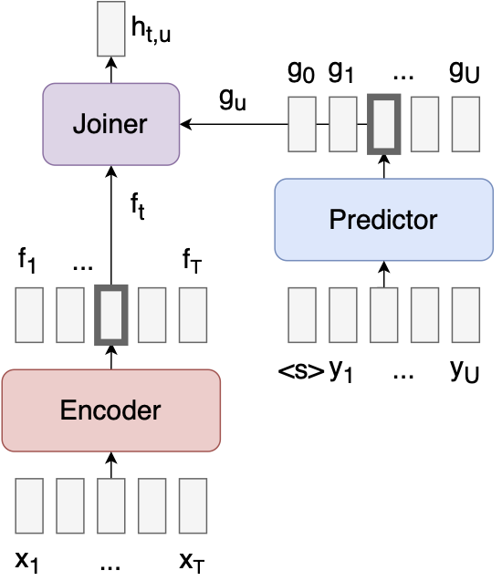

# ASR With RNN-T Models
A [PyTorch](https://github.com/pytorch/pytorch) repository for fine-tuning NVIDIA RNN-T BPE models using Hugging Face Datasets and the Hugging Face Trainer.

The modelling files are based very heavily on those from [NVIDIA NeMo](https://github.com/NVIDIA/NeMo). This is a standalone repository to enable rapid prototyping and involvement with the community. The final modelling files and training script will be merged into [Transformers 🤗](https://github.com/huggingface/transformers) to be used with the rest of the open-source library. The final system weights will be made publicly available at [huggingface.co](huggingface.co) 🚀

**Figure 1:** RNN-T Transducer Model[^1]

## Example Usage
[^1]: This is the first footnote.